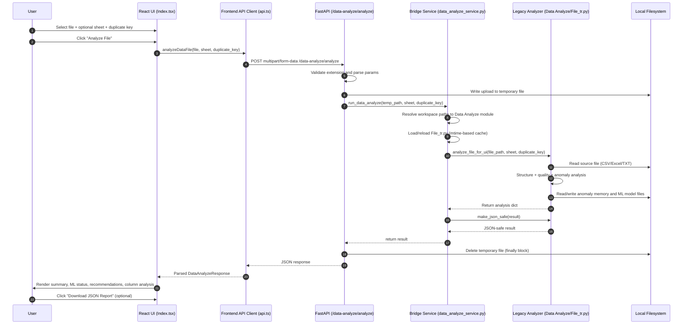

# Data Analyze Integration Flow

This document explains how the integrated Data Inspector (former Streamlit Data Analyze project) runs inside the current React + FastAPI app.

## Sequence Diagram

## Runtime Path

1. Frontend collects file and optional controls in `data-frontend/src/pages/Index.tsx`.
2. Frontend sends `multipart/form-data` to `POST /data-analyze/analyze` through `data-frontend/src/lib/api.ts`.
3. Backend endpoint in `data-backend/main.py` validates and stores the uploaded file temporarily.
4. Backend calls `run_data_analyze(...)` in `data-backend/services/data_analyze_service.py`.
5. Bridge service dynamically imports `Data Analyze/File_tr.py` and binds absolute paths:
   - `MEMORY_FILE -> Data Analyze/anomaly_memory.csv`
   - `MODEL_PATH -> Data Analyze/anomaly_model.pkl`
6. Legacy analyzer runs `analyze_file_for_ui(...)` and returns report + anomalies + ML status.
7. Bridge converts output to JSON-safe primitives via `make_json_safe(...)`.
8. Backend returns response and always removes temp file in `finally`.
9. Frontend renders the result in Data Inspector cards and sections.

## Why Bridge Service Exists

- Avoids duplicating legacy analyzer logic in FastAPI.
- Keeps `main.py` focused on HTTP concerns.
- Supports hot updates to `File_tr.py` using mtime-based reload.
- Centralizes path wiring for model/memory artifacts.

## Error-Handling Notes

- Unsupported file types return `400`.
- Any analyzer failure is wrapped as `500` with detail from backend.
- Temp files are cleaned up even on failure.

## Key Files

- `data-backend/main.py`
- `data-backend/services/data_analyze_service.py`
- `Data Analyze/File_tr.py`
- `data-frontend/src/lib/api.ts`
- `data-frontend/src/pages/Index.tsx`
